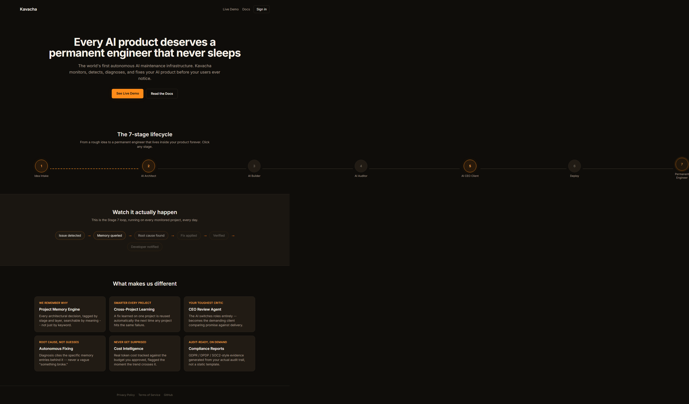
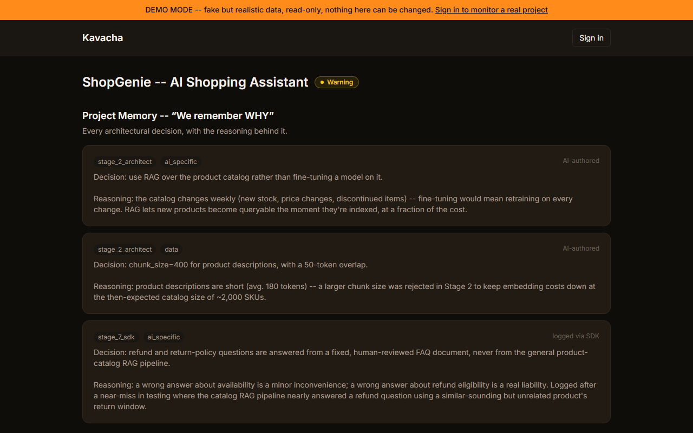
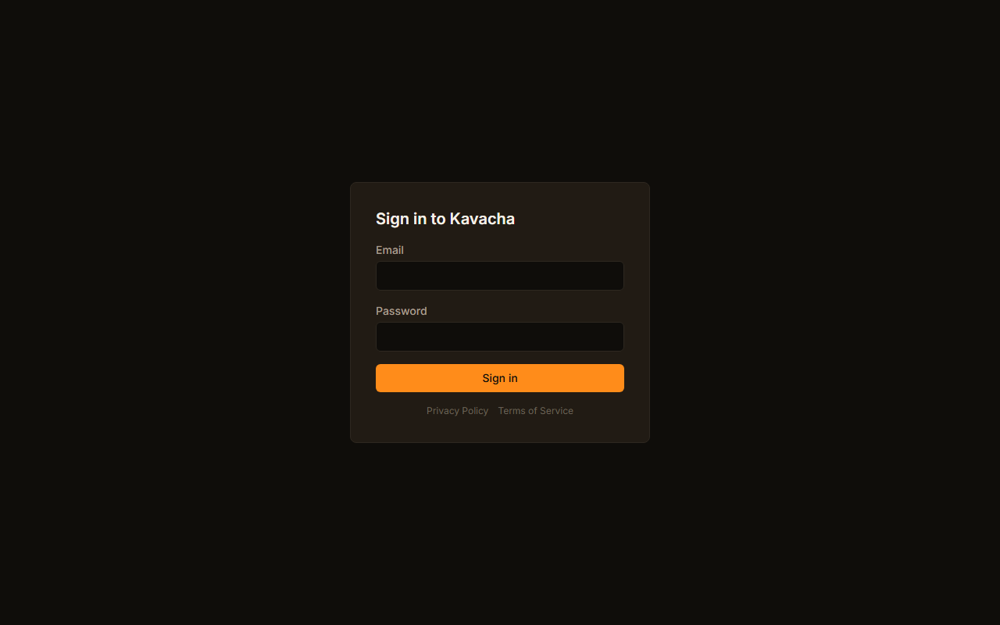
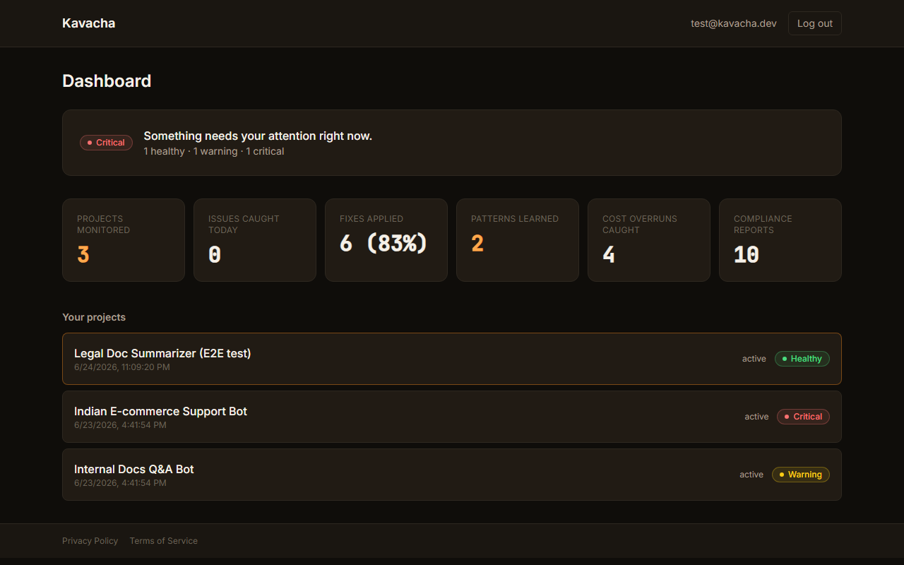
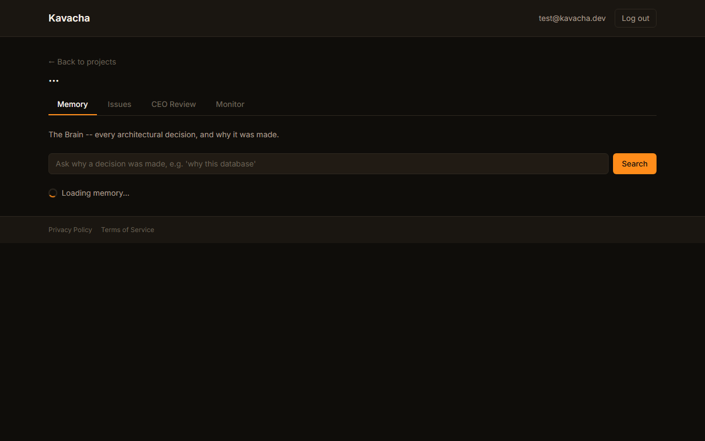
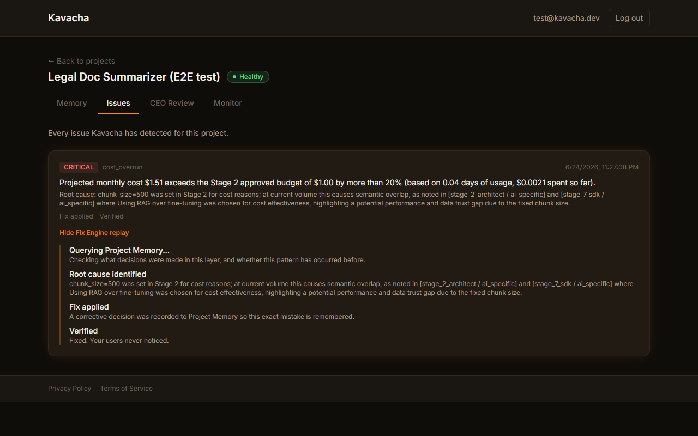
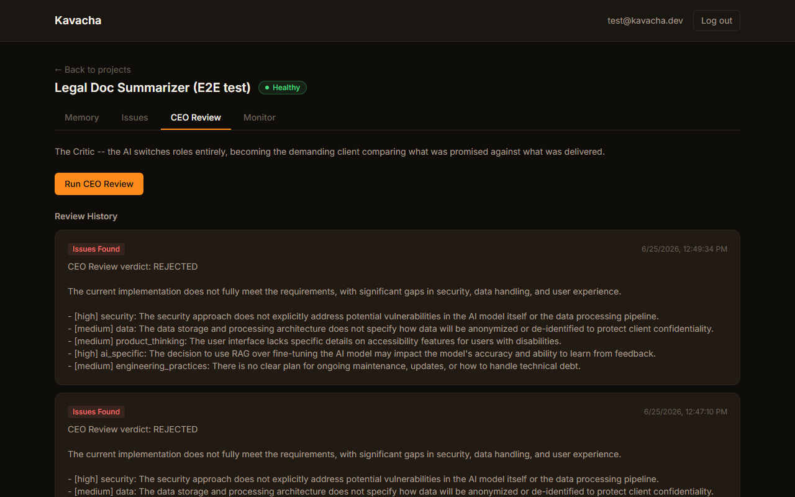
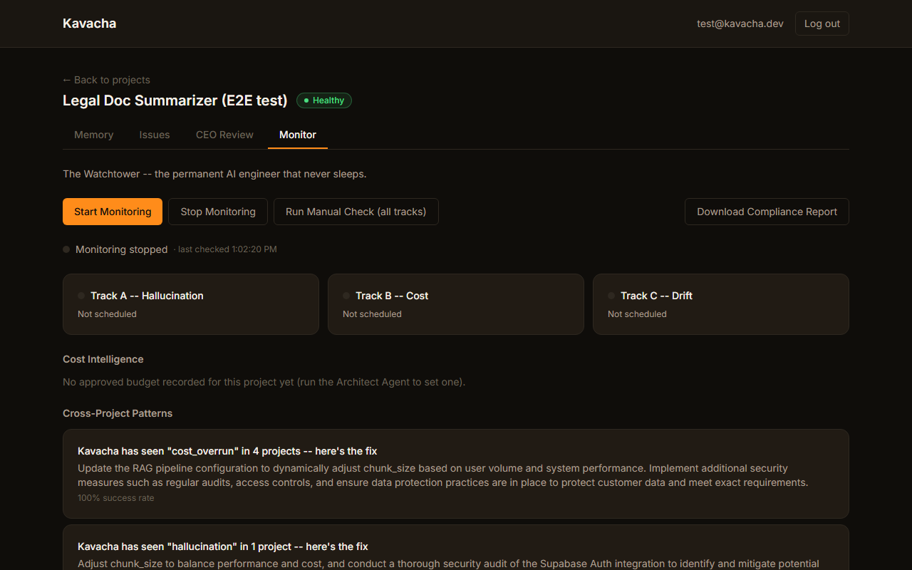

```
██╗  ██╗ █████╗ ██╗   ██╗ █████╗  ██████╗██╗  ██╗ █████╗
██║ ██╔╝██╔══██╗██║   ██║██╔══██╗██╔════╝██║  ██║██╔══██╗
█████╔╝ ███████║██║   ██║███████║██║     ███████║███████║
██╔═██╗ ██╔══██║╚██╗ ██╔╝██╔══██║██║     ██╔══██║██╔══██║
██║  ██╗██║  ██║ ╚████╔╝ ██║  ██║╚██████╗██║  ██║██║  ██║
╚═╝  ╚═╝╚═╝  ╚═╝  ╚═══╝  ╚═╝  ╚═╝ ╚═════╝╚═╝  ╚═╝╚═╝  ╚═╝
```

### The world's first autonomous AI maintenance infrastructure

[](https://kavacha-backend-production.up.railway.app/health)
[](https://kavacha-rho.vercel.app)
[](kavacha-sdk/pyproject.toml)

**Live dashboard:** https://kavacha-rho.vercel.app
**Live demo (no signup needed):** https://kavacha-rho.vercel.app/demo
**Live API:** https://kavacha-backend-production.up.railway.app ([health check](https://kavacha-backend-production.up.railway.app/health))

---

## The problem

Every AI product breaks the same silent way: it hallucinates in production and nobody knows until a user complains, model behavior drifts over weeks until the damage is already done, and a fix gets applied with no record of *why* — six months later the same bug comes back because the original reasoning was never written down anywhere. Datadog watches infrastructure, Sentry catches errors, LangSmith gives ML teams observability — but none of them remember the decisions behind the code, diagnose root cause from that history, and fix the problem themselves. Kavacha is the system that does all three: permanent project memory, autonomous root-cause diagnosis, and a fix engine that closes the loop and tells you in plain language what happened.

## The 7-stage lifecycle

```
Idea Intake → AI Architect → AI Builder → AI Auditor → AI CEO Client → Deploy → Permanent Engineer
```

| # | Stage | What it does | V1 status |
|---|---|---|---|
| 1 | Idea Intake | Plain-language input, rough and incomplete | ✅ Built |
| 2 | AI Architect | Interrogates the idea, produces a spec across 8 layers, logs every decision to memory | ✅ Built |
| 3 | AI Builder | Directs Claude Code layer by layer from the spec | ⬜ Not in V1 |
| 4 | AI Auditor | Reviews every layer, raises and fixes issues | ⬜ Folded into Stage 5 for V1 |
| 5 | AI CEO Client | Switches role to demanding client, compares promise vs. delivery | ✅ Built |
| 6 | Deploy | Manages deployment, generates documentation | ⬜ Done manually for this release |
| 7 | Permanent Engineer ← **the core innovation** | Monitors, diagnoses, fixes, verifies, notifies — forever | ✅ Built |

V1 ships Stages 2, 5, and 7 — the Architect, the CEO Review, and the permanent monitoring/fix loop. Stages 3, 4, and 6 are real engineering work for a later version; see [ARCHITECTURE.md](ARCHITECTURE.md) for the honest stage-by-stage status.

## Tech stack


## Architecture

```
[Any AI Product Anywhere]
         │ pip install kavacha; kavacha.watch(app)
         ▼
[Kavacha Backend — FastAPI, Railway]
         │
   ┌─────┴─────────────────────────┐
   ▼                                ▼
[Project Memory Engine] ──────▶ [Monitor Agent — 3 tracks]
   │            │                  │ (Track A hallucination,
   ▼            ▼                  │  Track B cost, Track C drift)
[Postgres]  [ChromaDB]             ▼
(Supabase)  (semantic         [Fix Engine] ──▶ [fix_patterns]
             search,               │           (cross-project
             Railway Volume)       ▼            learning)
                              [Notification: SendGrid]
                                    │
                                    ▼
                              [Memory Update — logs everything back]
```

Full system design, the 3 deliberate additions beyond the original spec, and honestly-documented limitations: **[ARCHITECTURE.md](ARCHITECTURE.md)**

## The 3 unique additions

Beyond what Datadog, Sentry, or LangSmith do — because none of them combine project memory with autonomous fixing:

1. **Cross-project pattern learning** — a fix learned on one project (`fix_patterns`, deliberately global, no `project_id`) is reused automatically the next time *any* project hits the same kind of issue. Verified live: a `cost_overrun` pattern's `project_count` grew from 3 to 4 the moment a brand-new test project hit the same failure mode.
2. **Cost intelligence** — every LLM call's real token usage and cost is recorded (`llm_usage`), projected against the budget approved back in Stage 2, and flagged the moment the trend crosses it by more than 20%.
3. **Compliance report generator** — GDPR / India DPDP Act / SOC 2-style evidence sections generated on demand from a project's *actual* audit trail, not a static template, and saved so each report is independently re-fetchable later.

## Security

Built against a 9-rule security addendum from day one: zero-knowledge secrets, per-project data isolation, an immutable audit trail, least-privilege database roles, raw user data never reaching an LLM, prompt-injection/secret sanitization on every memory write, hard limits on agent autonomy (no autonomous code or infra changes in V1), a standard web security baseline (JWT auth, rate limiting, parameterized SQL, locked-down CORS), and security treated as a first-class concern at every stage rather than a final pass.

Every rule is backed by a file reference and, where relevant, a real bug found and fixed during testing or deployment — not just a description of intent: **[SECURITY.md](SECURITY.md)**

## Screenshots

| | |
|---|---|
|  |  |
| Public landing page — the 7-stage pipeline, clickable | `/demo` — explore a full fake project, no signup, read-only |
|  |  |
| Sign in (Supabase auth, JWT held in memory only) | Real aggregate metrics across every monitored project |
|  |  |
| Every architectural decision, searchable by meaning | A real cost-overrun issue, with the Fix Engine's 5-step reasoning replayed |
|  |  |
| The AI switches roles to demanding client and finds real gaps | Live tracks, cost intelligence, cross-project pattern matches |

All screenshots are of the actual deployed app at the URLs above, not mockups. Try the live demo yourself: **https://kavacha-rho.vercel.app/demo**

## Quick start (SDK)

Not yet published to PyPI — install straight from this repo:

```bash
pip install "git+https://github.com/omshrirao-dev/kavacha.git#subdirectory=kavacha-sdk"
```

```python
import kavacha

kavacha.init(api_key="kv_...", project_id="your-project-id")
kavacha.watch(your_ai_app)   # that's it
```

Register your project through the Architect Agent, then issue a key for it (there's no dashboard button for this yet — it's a direct API call):

```bash
curl -X POST https://kavacha-backend-production.up.railway.app/api/v1/projects/<project_id>/api-keys \
  -H "Authorization: Bearer <your-supabase-jwt>"
```

The raw key is returned exactly once. Full SDK docs, including what data is and isn't sent: [kavacha-sdk/README.md](kavacha-sdk/README.md)

## Run it locally

```bash
git clone https://github.com/omshrirao-dev/kavacha.git
cd kavacha

# Backend
python -m venv venv
./venv/Scripts/activate   # or source venv/bin/activate on macOS/Linux
pip install -r requirements.txt
cp .env.example .env       # fill in your own Supabase + LLM provider keys
uvicorn app.main:app --reload

# Frontend (separate terminal)
cd frontend
npm install
cp .env.example .env
npm run dev
```

Requires a Supabase project (Postgres + Auth) with [`app/db/schema.sql`](app/db/schema.sql) applied, and at least one of Anthropic/Gemini/Groq configured as the LLM provider. See [.env.example](.env.example) for the full variable list.

## API documentation

Interactive Swagger docs (`/docs`, `/redoc`, `/openapi.json`) are intentionally only mounted when `APP_ENV=development` — disabled in production as part of the security baseline. Run locally and visit `http://localhost:8000/docs` for the live interactive spec, or see the endpoint table in [ARCHITECTURE.md](ARCHITECTURE.md).

## Project layout

```
app/             FastAPI backend (architect/CEO-review/monitor/fix-engine agents, memory engine, auth)
frontend/        React + TypeScript dashboard (Vite, Tailwind v4)
kavacha-sdk/     Official Python SDK (pip-installable, 3 lines of integration)
docs/            Screenshots used in this README
ARCHITECTURE.md  Full system design, stage-by-stage build status, known limitations
SECURITY.md      All 9 security rules with implementation evidence and real gaps found/fixed
```

---

Built in 21 days. Deployed live. *Har Har Mahadev.*
